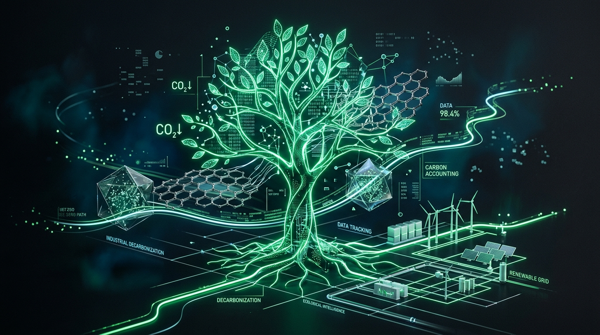

<div align="center">

# 🌱 CarbonIQ

### **AI-Powered Industrial Carbon Accounting & Budget Optimization Platform**

[](https://carboniq-rzvz.onrender.com)
[](LICENSE)
[](https://react.dev/)
[](https://www.typescriptlang.org/)
[](https://groq.com/)
[](https://supabase.com/)

<br />

> **Track. Optimize. Decarbonize.**  
> Real-time GHG Scope 1–3 emissions tracking, 0-1 Knapsack linear programming for carbon CapEx allocation, and automated ESG audit briefings powered by ultra-fast Groq Llama 3 inference.

<br />



<br />

🔗 **Live Production URL:** [https://carboniq-rzvz.onrender.com](https://carboniq-rzvz.onrender.com)

</div>

---

## 📑 Table of Contents
- [Overview](#-overview)
- [Core Features](#-core-features)
- [How It Works](#-how-it-works)
  - [1. Data Entry & Emissions Calculation](#1-data-entry--emissions-calculation)
  - [2. Linear Programming Budget Optimizer](#2-linear-programming-budget-optimizer)
  - [3. ESG Forecasting & AI Executive Summaries](#3-esg-forecasting--ai-executive-summaries)
- [System Architecture](#-system-architecture)
- [Tech Stack](#-tech-stack)
- [Environment Variables Guide](#-environment-variables-guide)
  - [Variable Reference Table](#variable-reference-table)
  - [How to Set Up `.env`](#how-to-set-up-env)
  - [Configuring On Render (Production)](#configuring-on-render-production)
- [Local Development Setup](#-local-development-setup)
- [Data Methodology & Verification Standards](#-data-methodology--verification-standards)
- [Project Structure](#-project-structure)
- [License](#-license)

---

## 🌍 Overview

Industrial facilities account for over **30% of global greenhouse gas emissions**. However, most plant operators and sustainability teams face significant roadblocks:
- **Fragmented Spreadsheets:** Emission data is scattered across manual logs with unverified conversion factors.
- **Unclear CapEx Allocation:** Budget allocation for decarbonization initiatives is frequently conducted without optimization, leading to suboptimal carbon ROI.
- **Reporting Burden:** Crafting compliant ESG statements conforming to **GHG Protocol** and **BRSR Core (SEBI India)** demands weeks of manual auditing.

**CarbonIQ** resolves these pain points by integrating high-fidelity **activity data logging**, a client-side **Knapsack LP optimizer**, and **Groq Llama 3 70B AI inference** to generate audit-ready mitigation briefings in sub-second latency.

---

## 🚀 Core Features

### 🖥️ 1. Interactive Multi-Screen Workspace
- **Screen 0 (Landing):** Public-facing product presentation highlighting platform capabilities.
- **Screen 0.5 (Auth):** Secure sign-in powered by Supabase Authentication (Google OAuth support).
- **Screen 1 (Dashboard):** High-level view of facility metrics, daily run-rate trends, and live AI provider health indicators.
- **Screen 2 (Activity Log):** Real-time activity entries categorized across GHG Scopes 1, 2, and 3 with automatic $\text{kg CO}_2\text{e}$ derivation.
- **Screen 3 (Budget Optimizer):** Mathematical portfolio selection finding the maximal carbon abatement within a strict CapEx budget constraint.
- **Screen 4 (Reports & Audit):** Continuation scenario forecasting (1 day, 1 week, 1 month), peer-reviewed industrial efficiency suggestions, and AI-generated auditor statements.

### 🧠 2. Real-Time Groq AI Endpoints
- **Carbon Budget Insights (`/api/groq/optimize-insights`):** Generates a 3-bullet executive briefing analyzing the economic abatement frontier (ROI per ton of $\text{CO}_2$), operational sequencing, and subsequent fiscal year recommendations.
- **ESG Audit Commentary (`/api/groq/audit-summary`):** Formal ISO 14064 & BRSR Core auditor statement assessing verification readiness and hotspot attribution.
- **Forecast Summary (`/api/groq/report-summary`):** Synthesizes measured data, baseline run-rates, and optimized project impacts into a concise, non-hallucinated report under 180 words.

---

## 🔬 How It Works

```
  [ Industrial Activity Logs ]             [ CapEx Budget Input (₹) ]
              │                                        │
              ▼                                        ▼
   Scope 1, 2, 3 Derivation                 PuLP 0-1 Knapsack Solver
(Quantity × Emission Factor)              (Maximizes Annual tCO2 Saved)
              │                                        │
              └───────────────────┬────────────────────┘
                                  │
                                  ▼
                   [ Executive ESG Audit Engine ]
                    • Continuation Run-Rate Model
                    • 1-Day / 1-Week / 1-Month Scenarios
                    • Evidence-Backed Efficiency Benchmarks
                                  │
                                  ▼
                     [ Groq Llama 3 70B LLM ]
                   Audit-Ready Executive Reports
```

### 1. Data Entry & Emissions Calculation
Users log emissions with verifiable metadata:
$$\text{Emissions } (\text{kg CO}_2\text{e}) = \text{Activity Quantity} \times \text{Verified Emission Factor}$$

Each record retains:
- **Scope 1:** Direct combustion (diesel generators, natural gas furnaces, onsite fuel).
- **Scope 2:** Indirect emissions (grid electricity consumption).
- **Scope 3:** Supply chain and logistics (freight, raw material transport).

### 2. Linear Programming Budget Optimizer
To resolve the classical **0-1 Knapsack Problem** for industrial carbon abatement:
$$\text{Maximize } \sum_{i=1}^{n} x_i \cdot \Delta C_i \quad \text{subject to} \quad \sum_{i=1}^{n} x_i \cdot K_i \le B, \quad x_i \in \{0, 1\}$$
- $B$ = Total CapEx budget (₹)
- $K_i$ = Capital expenditure cost of project $i$
- $\Delta C_i$ = Annual metric tons of $\text{CO}_2\text{e}$ abated by project $i$
- $x_i$ = Binary decision variable (1 if funded, 0 if rejected)

Built-in templates include **Rooftop Solar PV**, **Biogas RNG Recovery**, **Waste-Heat Recovery**, **Variable Frequency Drives (VFDs)**, **Industrial Heat Pumps**, and **Fleet Electrification**.

### 3. ESG Forecasting & AI Executive Summaries
The platform evaluates the facility's observed daily emissions run-rate over time:
$$\text{Daily Run Rate} = \frac{\sum \text{Logged Emissions}}{\text{Observed Days}}$$
Projections evaluate **1-Day**, **1-Week**, and **1-Month** continuation baselines compared directly against planned savings from the optimal project portfolio.

---

## 🏗️ System Architecture

```
┌─────────────────────────────────────────────────────────────┐
│                      Client Layer (SPA)                     │
│  React 19 • Vite • TypeScript • Lucide Icons • Tailwind CSS │
│  - State management via React Hooks                         │
│  - Instant client-side 0-1 Knapsack subset evaluator        │
└──────────────────────────────┬──────────────────────────────┘
                               │ JSON over HTTPS
┌──────────────────────────────▼──────────────────────────────┐
│                    Express.js Backend                       │
│  - Port 3000 / Production Static Asset File Server          │
│  - Secure API Proxying for Groq AI Inference                │
│  - Endpoints:                                               │
│    * /api/health                                            │
│    * /api/groq/status                                       │
│    * /api/groq/optimize-insights                            │
│    * /api/groq/audit-summary                                │
│    * /api/groq/report-summary                               │
└──────────────┬──────────────────────────────┬───────────────┘
               │                              │
┌──────────────▼──────────────┐ ┌─────────────▼───────────────┐
│       Groq Cloud API        │ │      Supabase Platform      │
│  - Model: llama3-70b-8192   │ │  - Google OAuth             │
│  - Sub-second LLM inference │ │  - User Profile Sessions    │
│  - Zero API key browser leak│ │  - Emission Factor Storage  │
└─────────────────────────────┘ └─────────────────────────────┘
```

---

## 🛠️ Tech Stack

| Layer | Technology | Purpose |
| :--- | :--- | :--- |
| **Frontend** | React 19, TypeScript, Vite | Ultra-responsive Single Page Application |
| **Styling** | Tailwind CSS v4 | Futuristic industrial dark-mode design system |
| **Icons** | Lucide React | Modern, lightweight UI iconography |
| **Backend** | Node.js, Express.js | API proxy, static bundle serving, health checking |
| **AI Inference**| Groq SDK (`llama3-70b-8192`)| Blazing fast Llama 3 70B inference engine |
| **Database & Auth** | Supabase (PostgreSQL & GoTrue) | User authentication & cloud session persistence |
| **Mathematical Solver** | TypeScript Knapsack / Python PuLP | 0-1 Integer Linear Programming solver |
| **Deployment** | Render Web Service | Continuous integration & cloud hosting |

---

## 🔑 Environment Variables Guide

### Variable Reference Table

| Variable Name | Required | Scope | Description |
|:---|:---:|:---:|:---|
| `GROQ_API_KEY` | **Yes** | Server | Your API Key from [console.groq.com](https://console.groq.com/keys) for Llama 3 70B inference. |
| `VITE_SUPABASE_URL` | **Yes** | Client (Vite) | Project URL found in your Supabase Dashboard under `Settings -> API`. |
| `VITE_SUPABASE_ANON_KEY` | **Yes** | Client (Vite) | Public anonymous key found under Supabase `Settings -> API`. |
| `SUPABASE_SERVICE_ROLE_KEY` | Optional | Server | Service-role key for backend/seeding scripts (never exposed to frontend). |
| `APP_URL` | Optional | Server | Host URL of the deployed application (e.g. `https://carboniq-rzvz.onrender.com`). |
| `VITE_APP_URL` | Optional | Client (Vite) | Public URL exposed to the frontend bundle for OAuth redirects. |
| `PORT` | Optional | Server | Server port (defaults to `3000` locally, assigned dynamically on Render). |
| `NODE_ENV` | Optional | Server | Runtime environment mode: `development` or `production`. |

---

### How to Set Up `.env`

1. Duplicate the `.env.example` template:
   ```bash
   cp .env.example .env
   ```

2. Open `.env` and fill in your actual credentials:
   ```env
   # ===================================================================
   # 1. AI Engine: Groq API Key
   # ===================================================================
   GROQ_API_KEY=gsk_your_actual_groq_api_key_here

   # ===================================================================
   # 2. Supabase Auth & Database
   # ===================================================================
   VITE_SUPABASE_URL=https://your-project-id.supabase.co
   VITE_SUPABASE_ANON_KEY=your-actual-anon-key-here
   SUPABASE_SERVICE_ROLE_KEY=your-optional-service-key

   # ===================================================================
   # 3. Server Configuration
   # ===================================================================
   APP_URL=http://localhost:3000
   VITE_APP_URL=http://localhost:3000
   NODE_ENV=development
   PORT=3000
   ```

> ⚠️ **Important Security Notice:** Never commit your `.env` file to version control. It is already included in `.gitignore`.

---

### Configuring On Render (Production)

If deploying on Render:
1. Navigate to your [Render Dashboard](https://dashboard.render.com).
2. Select your **CarbonIQ** Web Service.
3. Click **Environment** in the left sidebar menu.
4. Add the following Environment Variables:
   - `GROQ_API_KEY` = `<your-groq-api-key>`
   - `VITE_SUPABASE_URL` = `<your-supabase-url>`
   - `VITE_SUPABASE_ANON_KEY` = `<your-supabase-anon-key>`
   - `NODE_ENV` = `production`
5. Click **Save Changes**. Render will automatically trigger a clean deploy with the updated environment configurations.

---

## 💻 Local Development Setup

### Prerequisites
- [Node.js](https://nodejs.org/) (Version `>= 20.19.0 < 25`)
- [npm](https://www.npmjs.com/) (Version `>= 9.x`)

### Step-by-Step Installation

```bash
# 1. Clone the repository
git clone https://github.com/subhashdoc234xyz/CarbonIQ.git
cd CarbonIQ

# 2. Install project dependencies
npm install

# 3. Configure environment variables
cp .env.example .env
# Edit .env with your credentials

# 4. Start development server (Runs Express backend + Vite client)
npm run dev
```

Visit `http://localhost:3000` in your browser.

### Production Build & Verification

```bash
# Test production build bundle locally
npm run build

# Start the compiled production server
npm start
```

---

## 📊 Data Methodology & Verification Standards

CarbonIQ enforces rigorous emission verification practices:
- **GHG Protocol Corporate Accounting and Reporting Standard:** Delineates Scope 1 direct, Scope 2 indirect grid, and Scope 3 value-chain categories.
- **SEBI BRSR Core (India):** Tailored reporting parameters structured for mandatory Environmental, Social, and Governance compliance.
- **IPCC Emission Factor Database (EFDB) & CEA CO2 Database (India):** Reference emission baselines for electrical grids ($0.82 \text{ kg CO}_2/\text{kWh}$) and common industrial fuels.
- **Auditable Traceability:** The platform does not synthesize artificial activity values—every AI executive summary strictly reflects user-verified activity inputs and calculated math.

---

## 📁 Project Structure

```
CarbonIQ/
├── public/
│   └── assets/
│       └── banner.png            # Presentation dashboard preview
├── src/
│   ├── components/               # React Screen Views & UI Elements
│   │   ├── ActivityLogView.tsx   # Screen 2: Activity logs & scope filters
│   │   ├── BudgetOptimizerView.tsx # Screen 3: CapEx Knapsack LP optimizer
│   │   ├── DashboardView.tsx     # Screen 1: Facility high-level KPIs
│   │   ├── HeaderNav.tsx         # Top application header
│   │   ├── LandingPage.tsx       # Screen 0: Public introduction
│   │   ├── ReportsView.tsx       # Screen 4: ESG audit & AI summary
│   │   ├── Sidebar.tsx           # Desktop navigation bar
│   │   └── SignInModal.tsx       # Screen 0.5: Google OAuth modal
│   ├── data/
│   │   └── initialData.ts        # Baseline project templates
│   ├── services/
│   │   ├── authService.ts        # Supabase authentication helpers
│   │   └── groqService.ts        # Groq client proxy caller
│   ├── utils/
│   │   ├── emissionEstimator.ts  # Scope calculation formulas
│   │   └── pulpSolver.ts         # Pure TypeScript 0-1 Knapsack solver
│   ├── App.tsx                   # Main SPA router & navigation state
│   ├── main.tsx                  # React DOM entrypoint
│   └── types.ts                  # Shared TypeScript interfaces
├── .env.example                  # Environment configuration template
├── package.json                  # Scripts & project dependencies
├── render.yaml                   # Render Blueprint Infrastructure-as-Code
├── server.ts                     # Express server & Groq AI endpoints
├── tsconfig.json                 # TypeScript compiler configuration
└── vite.config.ts                # Vite build & bundler configuration
```

---

## 📜 License

This project is licensed under the [Apache-2.0 License](LICENSE).

---

<div align="center">
  <sub>Developed with precision by <a href="https://github.com/subhashdoc234xyz">Subhash Boopathi</a>. Built for industrial decarbonization.</sub>
</div>
